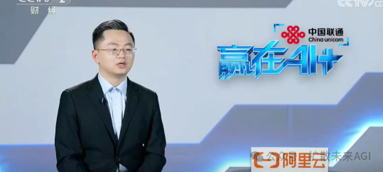
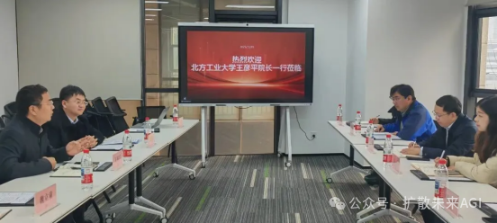
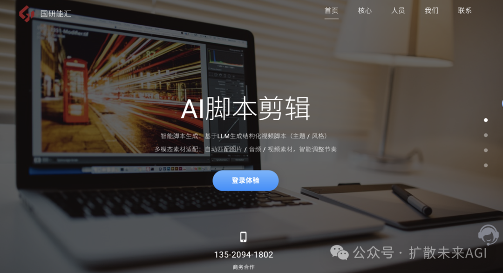
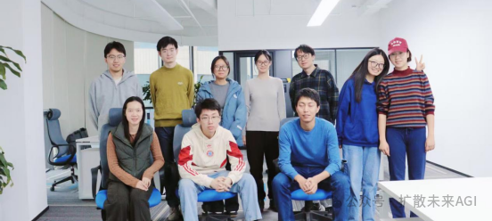
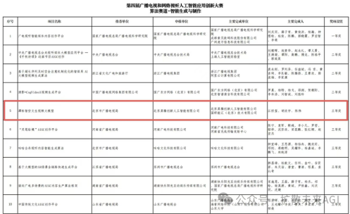
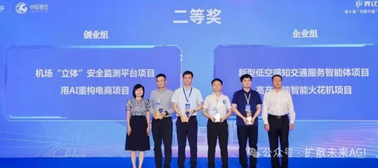

# 以AI赋能创作，共赴新征程

  

以AI赋能创作

共赴新征程

  

  

  

  

  

**亲爱的客户伙伴、并肩前行的同事们、关注行业发展的各位同仁：**

岁序更迭，华章日新。2025年AIGC技术爆发并席卷行业、视频创作领域迎来深刻变革的关键节点。此年，国研能汇紧扣“用AI重构视频创作”这一核心主线，在AIGC生成赛道上稳健前行。接下来，让我们共同回顾这一年的成长与突破，展望未来的发展方向。 

  

  

**1**

**年度核心成果：**

**数据见证实力，价值彰显担当**

  

**1**

**核心业务突破:**

**规模与质量双向提升**

**业务版图持续拓展：**

新增AIGC视频创作智能体、数字人、AI智能剪辑等核心业务板块，业务范围覆盖全国多个省市。同时，与广西广播电视台、智谱公司、潞晨科技、京西智谷公司、艾迪普公司等多家业界头部单位达成合作，成为其核心内容创作服务商；联合发起成立国内首家面向影视科技的产业协同平台——京西智映影视科技创新中心；成功申报北京市**“AI+广电传媒”**标杆性项目。

**产品服务迭代升级带动业绩增长：**

新增多场景智能适配、超高清画质生成等核心功能，用户创作效率提升80%；优化智能剪辑系统，实现视频理解、剪辑、调色、字幕生成全流程自动化。创新落地定制化AIGC视频解决方案，针对不同行业客户需求提供专属创作服务。到2025年底，公司营收超过千万元。

  

**2**

**技术创新亮点：**

 **硬核实力筑牢根基**

**研发成果硕果累累**：

2025年新增**4项专利**、**3项软著**，在“超高清视频快速生成”技术方向实现突破，将10分钟4K视频生成时间从2小时缩短至30分钟，**效率提升300%**；攻克多场景内容智能适配等关键技术，打破行业技术瓶颈。

**行业影响持续扩大：**

公司自主研发的元婴大模型于2025年5月30日登上央视CCTV2《赢在AI+》系列节目，与行业同仁共探技术发展方向，彰显技术引领地位。  

  

**3**

**社会责任践行：**

**初心如磐，温暖同行**

**产学研协同：**支持北方工业大学人工智能相关专业建设，由企业内专家担任校外导师，校内优秀毕业生参与企业实习，合作培养行业后备人才。

  

  

  

**2**

**标杆项目复盘：**

**北京市“AI+广电传媒”**

  

   作为国研能汇赋能广电行业的标杆实践，该项目精准对接北京“人工智能+广电传媒”战略需求，融合自研核心技术与广电业务场景，实现全流程智能化革新，落地京西智谷“潭柘智空”项目配套工程，获国家广电总局认可。

全模块技术闭环交付，涵盖视频智能理解等6大核心模块。其中，AI辅助剪辑模块实现自动化，AI视频风格化模块支持多风格迁移，系统集成模块对接“潭柘智空”文生视频系统。素材调用响应达秒级，提升视频内容识别准确率超92%，解决广电媒资管理与检索问题。  

项目使广电内容生产效率**提升****60%**、审核成本**降低40%**、媒资重复使用率**提高****75%**。其成功落地验证国研能汇技术落地能力，为跨行业应用奠基，彰显公司在AI视听技术领域的引领地位。   

  

  

  

**3**

**团队建设与荣誉认可：**

**凝聚人心，****共筑辉煌**

  

**1**

**团队成长**

**夯实人才根基，激发创新活力**

团队规模24人，研发人员占比达60％以上，硕士及以上学历人才占比达30％。成员架构呈现“资深引领+新锐攻坚”的人才梯队格局。研发体系的高占比优势为技术攻关、产品迭代提供了坚实的人才支撑，助力企业在激烈的市场竞争中持续筑牢技术壁垒、抢占发展先机。

  

**2**

**荣誉认可：实力铸就口碑，初心赢得赞誉**

**企业荣誉加身：**

先后荣获“第四届广播电视和网络视听人工智能应用创新大赛三等奖”“第十届创客中国创新创业大赛视觉智能方向二等奖”等多项国家级、市级奖项，获“国家科技型中小企业”认证，受园区“重点文化企业”表彰，成为行业标杆企业。团队核心成员获“北京市门头沟区算法卓越人才”等个人奖项，实现个人与企业价值同步提升。

基于AI视频创作优势与项目成果，国研能汇将推进技术创新，迭代元婴大模型与VisionConnect（视界通）能力，增强视频生成可控与适配程度。推动电商虚拟试穿、影视制作等场景规模化应用，推广降本增效经验。  

围绕核心业务，公司预计2026年营收超**3千万元**，计划于2026年3月前完成A轮融资，为技术研发及生态构建提供动力。联动产业联盟与高校资源，构建“技术-场景-生态”协同发展模式，打造全球领先的AI视听解决方案供应商，助力各行业数字化转型与文化传播创新。

公司秉持“以AI重构视频创作”使命，未来期望与客户伙伴、行业同仁携手，开启智能内容创作新征程！  

国研能汇（北京）技术有限公司孵化自北京大学信息技术高等研究院，致力于用AI重构视频创作。自主研发的元婴大模型具备端到端，多模态驱动，高一致性，表情生动，姿态自然等特色，也是首个人像和身体可控的大模型，并于5月登上央视CCTV2《赢在AI+》系列的节目 舞台。在应用技术服务方面，为央国企和知名上市公司提供自主安全可控的AIGC技术服务 公司现有AI剪辑项目就当下视频制作周期长，媒资管理粗放化等痛点相应推出自动拼接，视频理解技术，且政策市场广泛，已中标北京市“AI+广电传媒”标杆性项目，已与广西广播电视台、京西智谷公司、潞晨科技、智谱公司、艾迪普公司等伙伴达成合作。与此同时，公司积极探索电商短视频，社交娱乐等细分场景的AI视频创作应用。

国研能汇（北京）技术有限公司